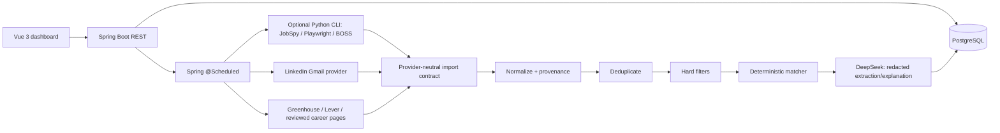

# Job Copilot — Architecture

## Recommended shape

Use a small monorepo with a Vue SPA, a Spring Boot modular monolith, PostgreSQL in Docker Compose, and an optional Python CLI for sources that genuinely need browser automation or JobSpy. Do not create a permanent FastAPI service merely to separate languages.



The Find Work project is currently empty. The following is the proposed repository structure, not an existing code layout:

```text
job-copilot/
├── frontend/                 # Vue 3 + TypeScript + Vite
├── backend/                  # Spring Boot modular monolith
├── collector/                # Optional Python CLI adapters
├── infra/docker-compose.yml  # PostgreSQL only for V1
├── docs/
├── PLAN.md
├── .env.example
└── .gitignore
```

## Component responsibilities

### Vue

Candidate profile editing, resume upload, provider switches/status, collection-run history, job list/detail, filters, evidence display, and later saved/application views. No provider credentials or matching logic live in the browser.

### Spring Boot

Use modules rather than deployable services:

```text
candidate   job   provider   collection   matching   shared
```

Spring owns the API, scheduler, provider registry, normalized persistence, deduplication, hard filtering, deterministic matching, DeepSeek gateway, retention cleanup, and audit-friendly run state. Providers return `ProviderImportRecord`; they do not execute SQL.

### Python collector

The Python process is started only for configured JobSpy or Playwright/BOSS work. It receives a bounded request, emits versioned JSON Lines, and exits. It has no database credentials. A non-zero exit marks that provider attempt failed while other providers continue.

### PostgreSQL

The sole durable store in V1. Use relational columns for fields queried or filtered frequently, JSONB for provider payload and extracted evidence, and separate posting/provenance rows when one role appears on multiple sources. Redis, a queue, and pgvector are deliberately postponed.

## Provider contract

Every provider must return:

- provider name and adapter version;
- source job ID when available;
- source URL and retrieval time;
- title, company, location, remote type, employment type, dates, description and raw payload when permitted;
- a confidence/quality flag and parse warnings.

The ingestion boundary is shared; Java and Python do not share an artificial class interface. Spring adapters implement the contract directly; Python serializes it.

## Collection and scheduling

- LinkedIn alert-email provider: daily while Spring is running.
- BOSS/JobSpy/browser, ATS, reviewed career pages, and other providers: weekly while Spring is running.
- On startup, record a missed schedule and offer an explicit catch-up run; do not silently run an unlimited backlog.
- Each provider has timeout, bounded retry, backoff, and an independent `collection_run_attempt` state.
- A run is `SUCCEEDED`, `PARTIAL`, `FAILED`, or `SKIPPED`; previous successful data remains usable.

## Data flow rules

1. Collect without scoring.
2. Parse into provider-neutral records.
3. Normalize names, titles, locations, URLs, dates, salary units, and remote type.
4. Upsert source occurrences; calculate fingerprints.
5. Mark exact duplicates; leave probable duplicates reviewable.
6. Apply explicit hard filters and persist rejection reasons.
7. Score surviving jobs with deterministic features.
8. Call DeepSeek only when extraction or explanation is missing/stale and the provider is enabled.
9. Store score components, evidence, model/algorithm versions, and timestamps.

## DeepSeek boundary

DeepSeek is reached through a Spring `AiGateway` configured by environment variables. The gateway sends only redacted resume text/structured profile and the minimum job text needed. It requests structured JSON for extraction and explanations. The deterministic matcher remains authoritative. API failures leave the deterministic result intact and mark the explanation as unavailable.

## Security boundary

V1 binds to `127.0.0.1`, has no login UI, and does not expose the app to the LAN. Gmail tokens, DeepSeek keys, and browser profile locations are local secrets. Browser automation must reuse a user-controlled session only when explicitly enabled; no passwords, cookies, proxy pools, CAPTCHA solving, or stealth bypass logic are part of this design.

## Deferred architecture

Add Redis/queue only for measured multi-process coordination or long-running jobs. Add pgvector only after an offline evaluation shows embeddings improve recall/precision over the explainable baseline. Split Python into FastAPI only if multiple clients need a stable NLP API. Add auth and a user table only when remote or multi-user use is approved.
